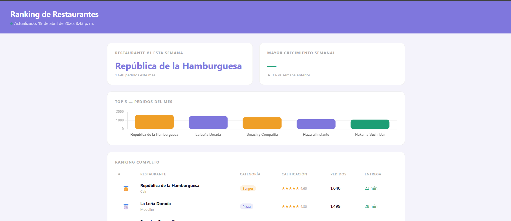
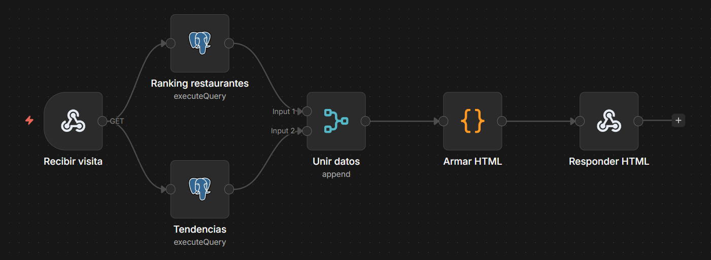
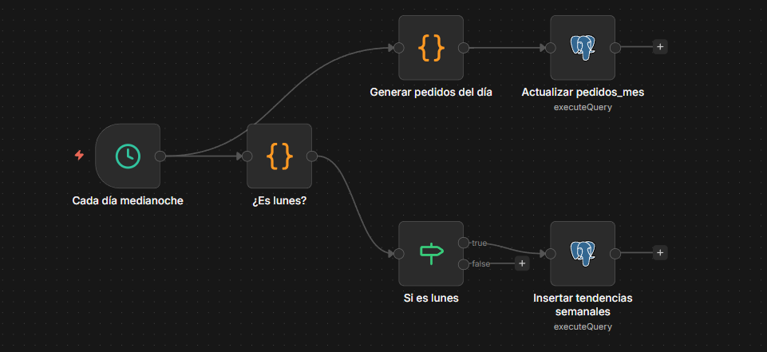
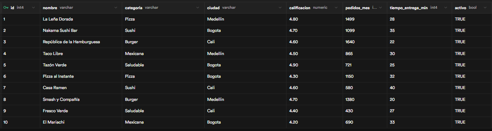
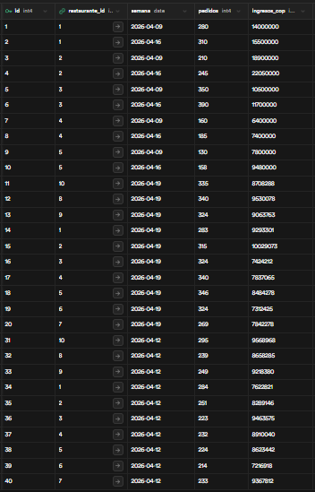
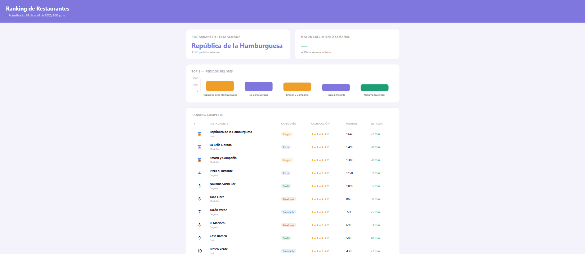
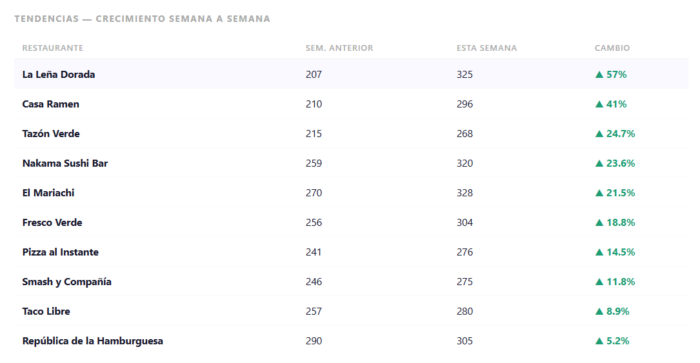
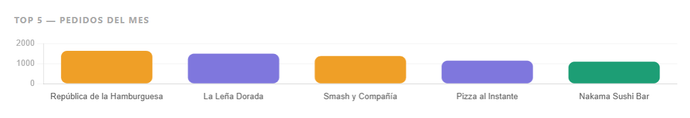

# 🍽️ Ranking de Restaurantes — Tablero Público en Tiempo Real



Página web pública y dinámica que muestra el ranking de restaurantes en tiempo real. Los datos se consultan desde una base de datos PostgreSQL en Supabase cada vez que alguien abre la URL, y se actualizan automáticamente cada noche mediante un workflow de n8n.

---

## 📋 ¿Qué hace el proyecto?

- Muestra el **ranking de los 10 restaurantes** con más pedidos del mes
- Visualiza el **Top 5** en una gráfica de barras con Chart.js
- Compara el **crecimiento semanal** de cada restaurante vs la semana anterior
- Destaca el **restaurante #1** y el de **mayor crecimiento**
- Se **auto-actualiza cada 5 minutos** sin que el usuario recargue
- Los datos se **actualizan solos cada noche** gracias a n8n

---

## 🛠️ Stack tecnológico

| Herramienta | Rol |
|---|---|
| **n8n** (Docker) | Automatización — recibe visitas y genera el HTML |
| **Supabase (PostgreSQL)** | Base de datos — almacena restaurantes y tendencias |
| **Chart.js** | Visualización — gráfica de barras del Top 5 |
| **Docker** | Contenedor para correr n8n localmente |
| **ngrok** | Exposición pública de la URL local |
| **HTML / CSS / JS** | Frontend — generado dinámicamente por n8n |

---

## 🏗️ Arquitectura del proyecto

```
Usuario abre la URL
        ↓
   ngrok (túnel público)
        ↓
  n8n en Docker (localhost:5678)
        ↓
  Webhook — /webhook/ranking
        ↓
  ┌─────┴─────┐
  ↓           ↓
SQL ranking  SQL tendencias
  ↓           ↓
  └─────┬─────┘
        ↓
   Unir datos
        ↓
   Armar HTML
   (Chart.js)
        ↓
  Responder HTML
        ↓
  Página en vivo
```

---

## 📂 Workflows de n8n

### Workflow 1 — `1-ranking-restaurantes.json`

Recibe cada visita a la URL y genera la página HTML en tiempo real.



**Nodos:**
- **Recibir visita** — Webhook en `/webhook/ranking`
- **Ranking restaurantes** — SELECT top 10 por pedidos del mes
- **Tendencias** — SELECT con crecimiento semana a semana
- **Unir datos** — Merge en modo Append
- **Armar HTML** — Código JS que construye el HTML completo
- **Responder HTML** — Devuelve el HTML con Content-Type text/html

### Workflow 2 — `2-simular-datos-automatico.json`

Se ejecuta automáticamente cada noche a medianoche y actualiza los datos.



**Nodos:**
- **Cada día medianoche** — Cron trigger `0 0 * * *`
- **¿Es lunes?** — Detecta si hoy es lunes
- **Generar pedidos del día** — Suma pedidos aleatorios realistas por restaurante
- **Actualizar pedidos_mes** — UPDATE en tabla `restaurantes`
- **Si es lunes** — Condicional IF
- **Insertar tendencias semanales** — INSERT en tabla `tendencias`

---

## 🗄️ Base de datos — Supabase

### Tabla `restaurantes`



```sql
CREATE TABLE restaurantes (
  id SERIAL PRIMARY KEY,
  nombre VARCHAR(100),
  categoria VARCHAR(50),
  ciudad VARCHAR(50),
  calificacion NUMERIC(3,2),
  pedidos_mes INTEGER,
  tiempo_entrega_min INTEGER,
  activo BOOLEAN DEFAULT TRUE
);
```

### Tabla `tendencias`



```sql
CREATE TABLE tendencias (
  id SERIAL PRIMARY KEY,
  restaurante_id INTEGER REFERENCES restaurantes(id),
  semana DATE,
  pedidos INTEGER,
  ingresos_cop BIGINT,
  CONSTRAINT tendencias_unique UNIQUE (restaurante_id, semana)
);
```

---

## 📊 Queries SQL principales

### Ranking top 10

```sql
SELECT nombre, categoria, ciudad,
       calificacion, pedidos_mes, tiempo_entrega_min
FROM restaurantes
WHERE activo = TRUE
ORDER BY pedidos_mes DESC
LIMIT 10;
```

### Tendencias semanales

```sql
SELECT r.nombre,
       t_actual.pedidos AS pedidos_esta_semana,
       t_anterior.pedidos AS pedidos_semana_anterior,
       ROUND(((t_actual.pedidos - t_anterior.pedidos)::numeric
              / t_anterior.pedidos) * 100, 1) AS crecimiento_pct
FROM tendencias t_actual
JOIN tendencias t_anterior
     ON t_actual.restaurante_id = t_anterior.restaurante_id
    AND t_anterior.semana = CURRENT_DATE - 7
    AND t_actual.semana = CURRENT_DATE
JOIN restaurantes r ON r.id = t_actual.restaurante_id
ORDER BY crecimiento_pct DESC;
```

---

## 📸 Capturas del proyecto

### Tablero completo


### Sección de tendencias


### Gráfica Top 5


---

## ⚙️ Cómo ejecutar el proyecto

### Requisitos
- [Docker](https://www.docker.com/) instalado
- Cuenta en [Supabase](https://supabase.com/)
- [ngrok](https://ngrok.com/) instalado

### Pasos

**1. Levantar n8n con Docker**
```bash
docker run -it --rm \
  --name n8n \
  -p 5678:5678 \
  -v n8n_data:/home/node/.n8n \
  n8nio/n8n
```

**2. Exponer con ngrok**
```bash
ngrok http 5678
```
Copia la URL pública que genera ngrok, por ejemplo:
```
https://[tu-subdominio].ngrok-free.dev
```

**3. Configurar Supabase**
- Crear proyecto en Supabase
- Ejecutar los scripts SQL de creación de tablas
- Copiar las credenciales de conexión PostgreSQL

**4. Importar workflows en n8n**
- Importar `1-ranking-restaurantes.json`
- Importar `2-simular-datos-automatico.json`
- Configurar credenciales de Postgres apuntando a Supabase
- Activar ambos workflows

**5. Insertar datos iniciales de tendencias**
```sql
INSERT INTO tendencias (restaurante_id, semana, pedidos, ingresos_cop)
SELECT id, CURRENT_DATE - 7,
  FLOOR(200 + RANDOM() * 100)::int,
  FLOOR((200 + RANDOM() * 100) * 35000)::bigint
FROM restaurantes WHERE activo = TRUE
ON CONFLICT (restaurante_id, semana) DO UPDATE
  SET pedidos = EXCLUDED.pedidos;

INSERT INTO tendencias (restaurante_id, semana, pedidos, ingresos_cop)
SELECT id, CURRENT_DATE,
  FLOOR(250 + RANDOM() * 100)::int,
  FLOOR((250 + RANDOM() * 100) * 35000)::bigint
FROM restaurantes WHERE activo = TRUE
ON CONFLICT (restaurante_id, semana) DO UPDATE
  SET pedidos = EXCLUDED.pedidos;
```

**6. Abrir el tablero**
```
https://[tu-subdominio].ngrok-free.dev/webhook/ranking
```

---

## 🔄 ¿Cada cuánto se actualiza?

| Qué | Cuándo |
|---|---|
| La página se regenera | Cada visita |
| Auto-refresh del navegador | Cada 5 minutos |
| Pedidos del mes | Cada noche a medianoche |
| Tendencias semanales | Cada lunes a medianoche |

---

## 👩‍💻 Autora

Desarrollado por **Daniela Sánchez Valencia**
📧 sanchezvalenciadaniela42@gmail.com

---

## 📝 Licencia

Este proyecto es de uso libre para fines educativos y de portafolio.
